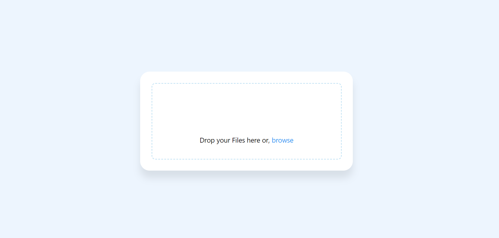
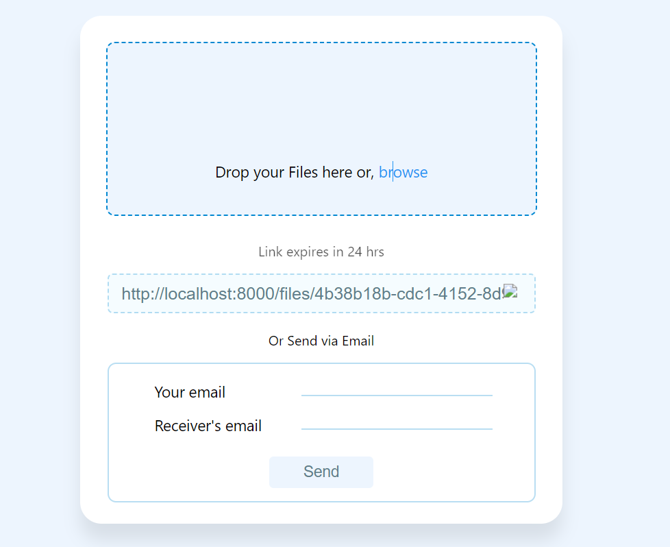

# File Sharing Application

This is a MERN stack-based file-sharing application that allows users to upload files and generate shareable links. The application also provides the ability to send these links via email using `nodemailer`. A unique identifier (UUID) is generated for each document uploaded, ensuring every file has a distinct link.

## Features
- Upload files to the server.
- Generate a unique link for each file using `uuid`.
- Email the link to a recipient using `nodemailer`.
- Uploaded links expire after 24 hours for security.

## Screenshots

### File Upload Interface


### Link Generated and Sharing Options


## Tech Stack
- **Frontend**: React
- **Backend**: Node.js, Express.js
- **Database**: MongoDB
- **File Storage**: Local storage or cloud
- **Email**: Nodemailer

## Setup and Installation

1. Clone the repository:
    ```bash
    git clone https://github.com/Niksha29/File-sharing.git
    cd File-sharing
    ```

2. Install dependencies:
    ```bash
    npm install
    ```

3. Set up your environment variables by creating a `.env` file in the root directory with the following variables:
    ```bash
    MONGO_URI=<Your MongoDB connection string>
    EMAIL_USER=<Your email for nodemailer>
    EMAIL_PASS=<Your email password>
    ```

4. Start the backend server:
    ```bash
    npm run server
    ```

5. Start the frontend server:
    ```bash
    npm run client
    ```

6. Open your browser and navigate to `http://localhost:3000`.

## How It Works

### UUID for Unique File Links

For each uploaded file, the application uses the `uuid` package to generate a unique identifier (UUID). This UUID is then used to create a unique, shareable link for the file. The generated link can be used to download the file, ensuring that each file has its own distinct link that cannot be duplicated.

### Sending Emails via Nodemailer

The application uses `nodemailer` to send the generated file link to a recipient via email. When the user provides an email address, `nodemailer` sends an email containing the file link directly to the recipient. This feature requires setting up an email service (such as Gmail) in the backend with proper authentication details (email and password). The email is sent using an SMTP service, ensuring that the recipient can access the file link from their inbox.

### Expiration of Links

To enhance security, the file links expire after 24 hours. This is managed by saving the upload timestamp in the database. When someone tries to access a file, the system checks if the link is still valid based on the time elapsed since the file was uploaded.

## How to Upload Files

1. Drag and drop files into the upload box.
2. After uploading, a unique link will be generated.
3. You can either copy the link manually or send it directly via email by providing the recipient's email address.
